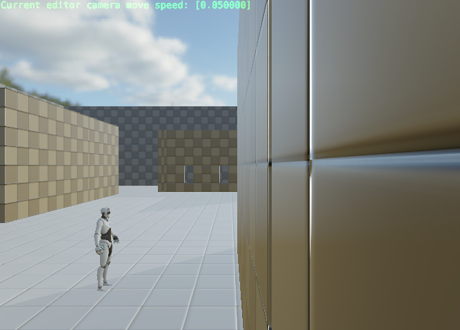
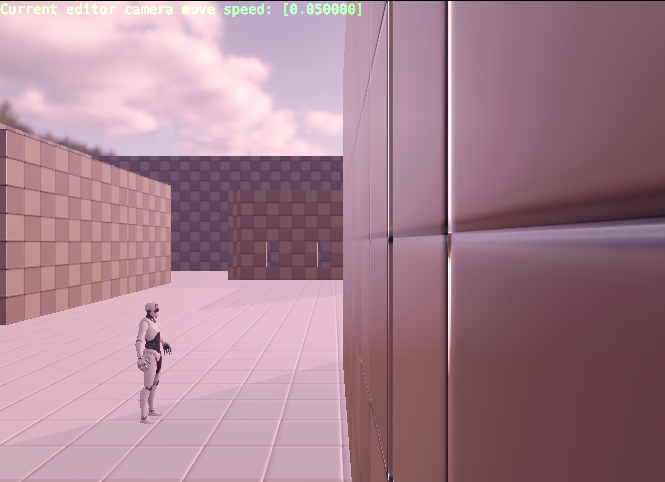
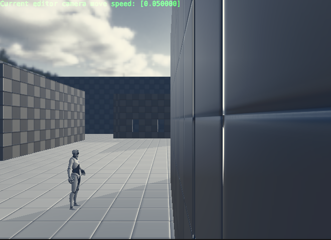
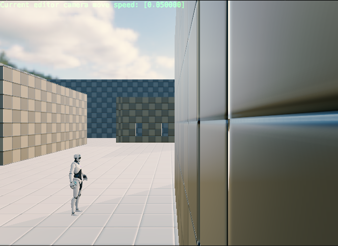
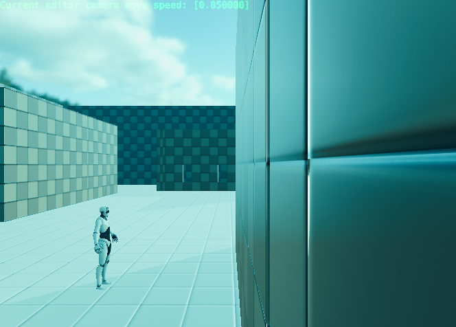
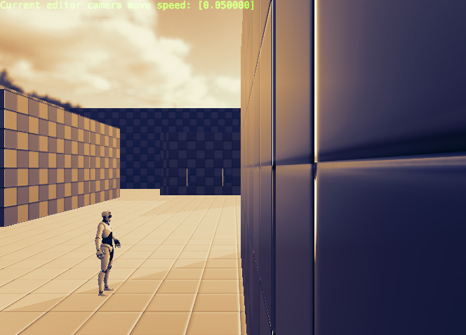
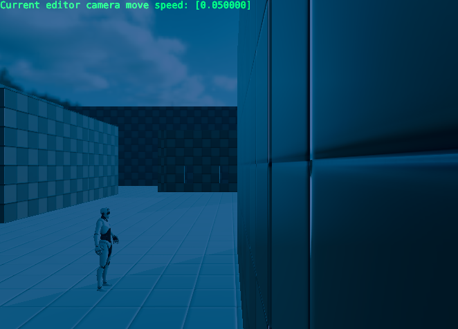
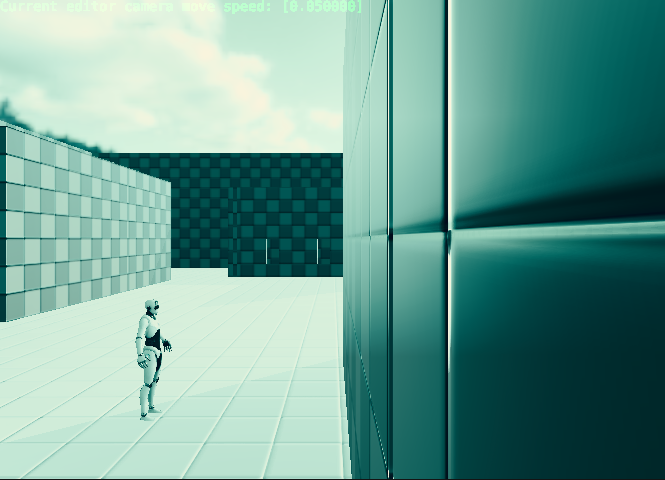
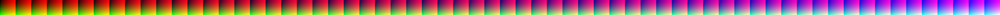
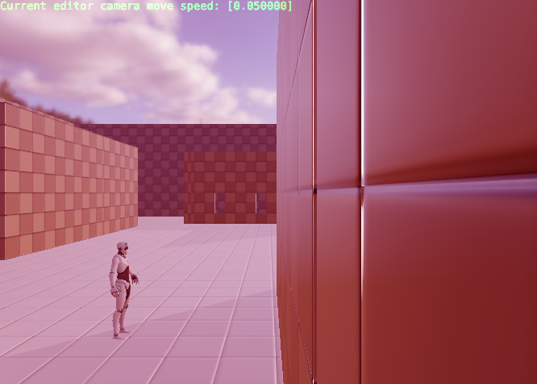

# YXH_XianYu's Color Grading

## 1. Color Grading with Default LUT

### 1.1 Result

* Origin Image
  * 
  
* `color_grading_LUT.jpg`
  * 
  * 

* `color_grading_lut_01.png`

  * 
  * 

* `color_grading_lut_02.png`

  * 
  * 

* `color_grading_lut_03.png`

  * 
  * 

* `color_grading_lut_04.png`

  * 
  * 

* `color_grading_lut_05.png`

  * 
  * 

* `color_grading_lut_06.png`

  * 
  * 

### 1.2 My Code

```glsl
const highp float EPS = 0.0001;
const highp float LUT_COLOR = 16.0; // 32.0 or 64.0

void main()
{
    highp ivec2 lut_tex_size = textureSize(color_grading_lut_texture_sampler, 0);
    highp float _COLORS      = float(lut_tex_size.y);

    highp vec4 color       = subpassLoad(in_color).rgba;
    
	/* Here is my answer (begin) */
    highp float b1 = min(1.0 - EPS, color.b) * LUT_COLOR;

    highp float u1 = floor(b1) / LUT_COLOR + color.r / LUT_COLOR;
    highp float u2 = ceil(b1) / LUT_COLOR + color.r / LUT_COLOR;
    highp float v = color.g;

    highp vec4 color1 = texture(color_grading_lut_texture_sampler, vec2(u1, v));
    highp vec4 color2 = texture(color_grading_lut_texture_sampler, vec2(u2, v));
    highp vec4 lut_color = mix(color1, color2, b1 - floor(b1));
	/* Here is my answer (end) */
    
    out_color = lut_color;
}
```

## 2 Color Grading with my LUT

* LUT effect is as follows

  * 
  * Hoshino is tired from work and wants to do something bad

    > “红温了”

* LUT

  * 

* Result

  * 

## 3. (Improvement) New Render Pass

### 3.1 目标

* 给Piccolo Engine添加Bloom效果

### 3.2 设计思路

* Render Pipeline
  * Bloom应该位于Tone Mapping之前，对HDR空间的图像进行操作
* Buffer
  * Bloom Pass共涉及5个ImageBuffer，分别设为A，B，C，D，E
  * A为原始图像
  * B为亮度提取后的图像（依赖于A）
    * 通过一个亮度阈值，只保留其中明亮部分
  * C为水平模糊后的图像（依赖于B）
  * D为竖直模糊后的图像（依赖于C）
  * E为Bloom最终图像（依赖于A和D）

#### 3.2.1 添加Buffer

* 因为在处理过程中，我们总共需要使用3个缓存Buffer（2个输入与1个输出，而Piccolo只提供了2个缓存Buffer（`backup_buffer_odd` 和 `backup_buffer_even`），所以我们需要新添加一个Buffer
* 

